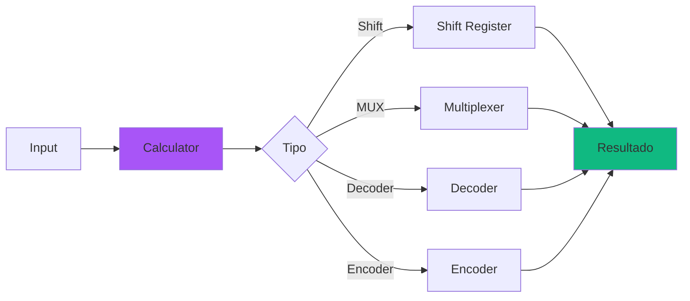
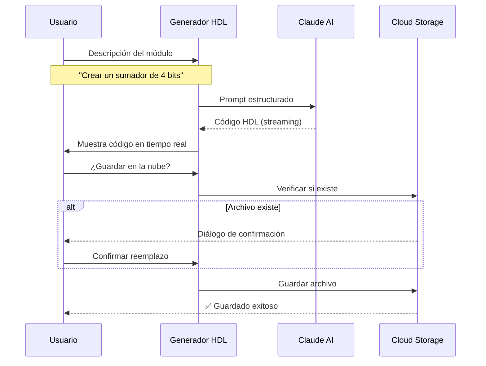
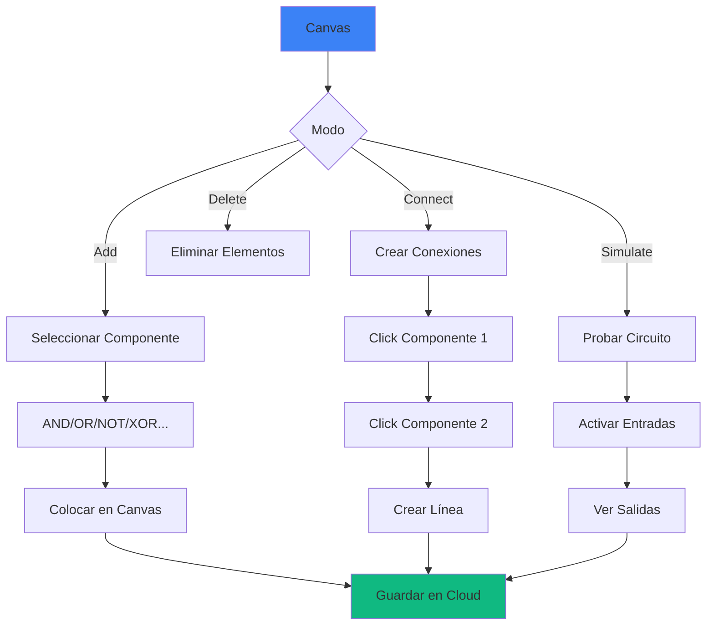
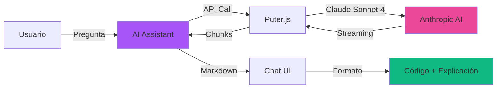
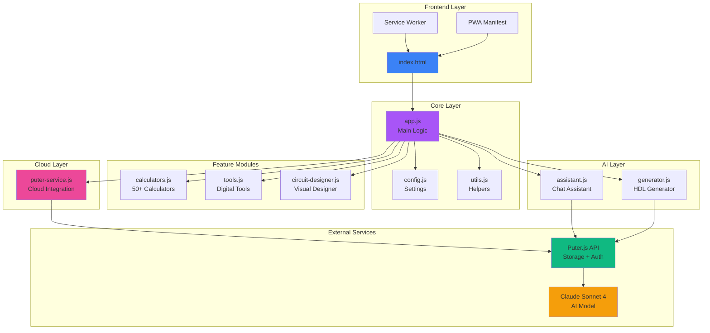
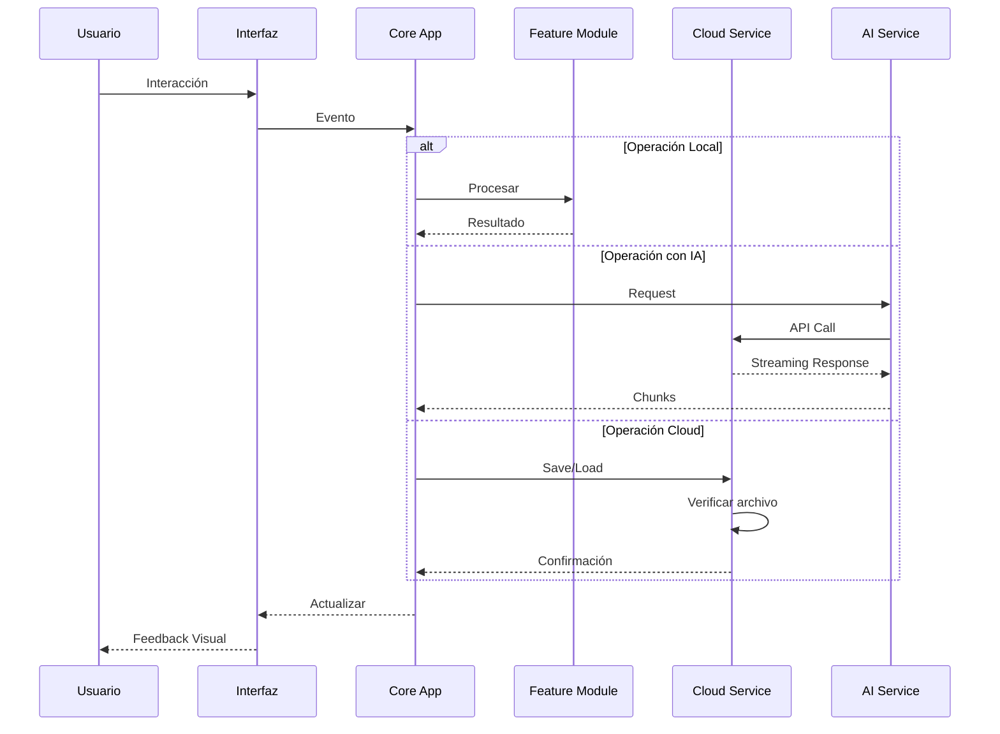
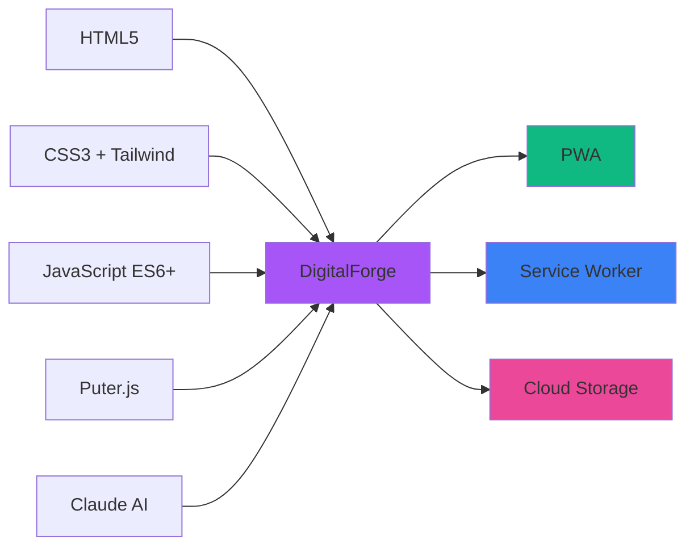

# ⚡ DigitalForge

<div align="center">


**Suite Profesional de Herramientas para Logica Digital**

*Calculadoras • Generadores HDL • Simuladores • Convertidores • Analizadores • IA Integrada*

[🚀 Demo en Vivo](https://un2versidad.github.io/DigitalForge/) • [📖 Documentación](DEVELOPER_GUIDE.md)

</div>

---

## 📋 Tabla de Contenidos

- [Sobre el Proyecto](#-sobre-el-proyecto)
- [Categorías de Herramientas](#-categorías-de-herramientas)
- [Instalación](#-instalación)
- [Uso](#-uso)
- [Estructura del Proyecto](#-estructura-del-proyecto)
- [Licencia](#-licencia)

---

## 🎯 Sobre el Proyecto

**DigitalForge** es una suite completa de herramientas para ingeniería digital que incluye más de **50+ utilidades profesionales** organizadas en **10 categorías diferentes**. Desde calculadoras binarias hasta generadores de código HDL con IA, todo lo que necesitas para trabajar con sistemas digitales en un solo lugar.

### ✨ ¿Por qué DigitalForge?

-   **5A0+ Herramientas**: Calculadoras, convertidores, simuladores y analizadores
- 🤖 **IA Integrada**: Asistente inteligente con Claude Sonnet 4 y generador HDL automático
- ☁️ **Cloud Storage**: Guarda circuitos y código HDL en la nube con Puter.js
- 🎨 **Interfaz Moderna**: Diseño elegante con gradientes morados/rosas y animaciones suaves
- 📱 **PWA**: Instálalo como app nativa en cualquier dispositivo
---

## 📦 Categorías de Herramientas

### 1. 🧮 Calculators (Calculadoras)

Herramientas para cálculos y operaciones digitales:

- **Shift Register**: Operaciones de desplazamiento (left/right shift)
- **Multiplexer**: Simulador de MUX 2:1, 4:1, 8:1
- **Decoder**: Decodificadores 2:4, 3:8, 4:16
- **Encoder**: Codificadores de prioridad
- **Comparador**: Comparación de números binarios
- **ALU Simulator**: Simulador de Unidad Aritmético-Lógica



### 2. 💻 HDL (Generadores de Código)

Generación automática de código HDL con IA:

- **Generador VHDL**: Crea código VHDL desde descripciones en lenguaje natural
- **Generador Verilog**: Genera código Verilog optimizado
- **Templates**: Plantillas predefinidas para módulos comunes
- **Cloud Integration**: Guarda y carga tus diseños desde la nube
- **Verificación de Archivos**: Previene sobrescrituras accidentales



### 3. 🔬 Simulators (Simuladores)

Simulación de componentes digitales:

- **Compuertas Lógicas**: AND, OR, NOT, NAND, NOR, XOR, XNOR
- **Flip-Flops**: SR, JK, D, T
- **Contadores**: Ascendentes, descendentes, módulo N
- **Registros**: SISO, SIPO, PISO, PIPO
- **Máquinas de Estado**: Simulador de FSM

### 4. 🎨 Circuit Designer

Diseñador visual de circuitos lógicos:

- **Diseño Interactivo**: Arrastra y suelta componentes
- **Conexiones Visuales**: Une componentes con líneas
- **Simulación en Tiempo Real**: Prueba tu circuito al instante
- **Guardar en la Nube**: Sincroniza tus diseños
- **Cargar Ejemplos**: Circuitos predefinidos para aprender
- **Exportar**: Guarda tus diseños



### 5. 🔄 Converters (Convertidores)

Conversión entre sistemas numéricos:

- **Binario ↔ Decimal**: Conversión bidireccional
- **Hexadecimal ↔ Decimal**: Conversión hex-dec
- **Octal ↔ Decimal**: Conversión octal-dec
- **Binario ↔ Hexadecimal**: Conversión directa
- **ASCII ↔ Binario**: Conversión de texto
- **Complemento a 2**: Representación de negativos

### 6. 📊 Analyzers (Analizadores)

Análisis de funciones booleanas:

- **Tabla de Verdad**: Genera tablas automáticamente
- **Mapa de Karnaugh**: Simplificación visual de funciones
- **Expresiones Booleanas**: Simplifica expresiones
- **Forma Canónica**: SOP y POS
- **Minimización**: Algoritmo de Quine-McCluskey

### 7. 🛠️ Utilities (Utilidades)

Herramientas auxiliares:

- **Complemento a 2**: Cálculo y explicación
- **Paridad**: Generador de bits de paridad
- **Checksum**: Cálculo de checksums
- **CRC**: Generador de CRC
- **Gray Code**: Conversión a código Gray

### 8. 📐 Formulas (Fórmulas)

Fórmulas y cálculos electrónicos:

- **Ley de Ohm**: V = I × R
- **Potencia**: P = V × I
- **Frecuencia**: f = 1 / T
- **Capacitancia**: Cálculos de capacitores
- **Inductancia**: Cálculos de inductores
- **Divisor de Voltaje**: Cálculo de divisores
- **Filtros**: RC, RL, RLC

### 9. 🔌 Hardware

Calculadoras específicas para hardware:

- **Raspberry Pi GPIO**: Configuración de pines
- **Basys3 FPGA**: Calculadora para Digilent Basys3
- **ESP32 Power**: Consumo de energía ESP32
- **STM32 Clock**: Configuración de clock STM32
- **UART Baud Rate**: Cálculo de baud rate
- **I2C/SPI**: Configuración de buses

### 10. 🤖 AI Assistant

Asistente inteligente con IA:

- **Chat Interactivo**: Conversación natural con Claude Sonnet 4
- **Streaming Response**: Respuestas en tiempo real
- **Formato Markdown**: Código con syntax highlighting
- **Historial**: Guarda conversaciones
- **Ejemplos de Código**: Genera código funcional
- **Explicaciones Detalladas**: Conceptos de ingeniería digital



---

## 🏗️ Arquitectura

### Diagrama de Componentes



### Flujo de Datos



---

## 🛠️ Tecnologías

### Stack Principal



### Frontend
- **HTML5**: Estructura semántica moderna
- **CSS3**: Estilos con gradientes y animaciones
- **JavaScript ES6+**: Lógica de aplicación
- **Tailwind CSS**: Framework de utilidades CSS

### Servicios Externos
- **Puter.js**: Cloud storage, autenticación y AI
- **Claude Sonnet 4**: Modelo de IA de Anthropic
- **Font Awesome**: Biblioteca de iconos
- **MathJax**: Renderizado de fórmulas matemáticas

### PWA (Progressive Web App)
- **Service Worker**: Caché inteligente y soporte offline
- **Web App Manifest**: Instalación como app nativa
- **Cache API**: Almacenamiento de recursos

---

## 📦 Instalación

### Opción 1: Uso Directo (Recomendado)

1. **Clona el repositorio**:
```bash
git clone https://github.com/Un2versidad/DigitalForge.git
cd digitalforge-pro
```

2. **Inicia un servidor local**:

Con Python:
```bash
python -m http.server 8000
```

Con Node.js:
```bash
npx serve
```

Con PHP:
```bash
php -S localhost:8000
```

3. **Abre en tu navegador**:
```
http://localhost:8000
```

### Opción 2: Instalación como PWA

1. Visita el sitio web en tu navegador
2. Click en el icono de instalación (⊕) en la barra de direcciones
3. Confirma la instalación
4. ¡Listo! Ahora tienes DigitalForge como app nativa

### Opción 3: Deploy en la Nube

**Vercel**:
```bash
vercel --prod
```

**Netlify**:
```bash
netlify deploy --prod
```

**GitHub Pages**:
```bash
git push origin main
# Activa GitHub Pages en la configuración del repositorio
```

---

## 🚀 Uso

### 1. Calculadoras

```javascript
// Ejemplo: Usar el Shift Register
1. Ve a la pestaña "Calculators"
2. Busca "Shift Register"
3. Ingresa un valor binario: 10110101
4. Ingresa posiciones: 2
5. Click en "Shift Left" o "Shift Right"
6. ¡Resultado instantáneo!
```

### 2. Generador HDL con IA

```javascript
// Ejemplo: Generar un sumador en VHDL
1. Ve a la pestaña "HDL"
2. Escribe: "Crear un sumador completo de 4 bits"
3. Selecciona lenguaje: VHDL
4. Click en "Generate"
5. Espera la generación (streaming en tiempo real)
6. Click en "Save to Cloud" para guardar
```

### 3. Circuit Designer

```javascript
// Ejemplo: Diseñar un circuito AND-OR
1. Ve a la pestaña "Circuit Designer"
2. Selecciona componente "AND"
3. Click en el canvas para colocar
4. Selecciona componente "OR"
5. Click en el canvas para colocar
6. Selecciona modo "Connect"
7. Click en salida de AND, luego en entrada de OR
8. Click en "Simulate" para probar
9. Click en "Save to Cloud" para guardar
```

### 4. Convertidores

```javascript
// Ejemplo: Convertir binario a hexadecimal
1. Ve a la pestaña "Converters"
2. Busca "Binary to Hex"
3. Ingresa: 11010110
4. Resultado automático: D6
5. Click en "Copy" para copiar
```

### 5. AI Assistant

```javascript
// Ejemplo: Preguntar sobre compuertas
1. Click en el icono del robot (esquina inferior derecha)
2. Escribe: "¿Cómo funciona una compuerta XOR?"
3. Presiona Enter
4. Espera la respuesta (streaming)
5. Lee la explicación con ejemplos de código
```

**Ejemplos de preguntas para el AI Assistant:**
- "¿Qué es el complemento a 2?"
- "Genera un contador de 8 bits en Verilog"
- "Explica la diferencia entre flip-flop D y JK"
- "¿Cómo funciona un multiplexer 4:1?"
- "Crea un decodificador 3:8 en VHDL"

---

## 📁 Estructura del Proyecto

```
DigitalForge/
├── 📄 index.html                    # Punto de entrada principal
├── 📄 manifest.json                 # PWA manifest
├── 📄 service-worker.js             # Service worker para PWA
├── 📄 README.md                     # Este archivo
│
├── 📁 assets/                       # Recursos estáticos
│   └── 📁 styles/
│       └── main.css                 # Estilos principales
│
├── 📁 js/                           # Módulos JavaScript
│   ├── 📁 core/                     # Núcleo de la aplicación
│   │   ├── app.js                   # Lógica principal (tabs, UI)
│   │   ├── config.js                # Configuración global
│   │   └── utils.js                 # Funciones auxiliares
│   │
│   ├── 📁 features/                 # Módulos de características
│   │   ├── calculators.js           # 50+ calculadoras
│   │   ├── tools.js                 # Herramientas digitales
│   │   └── circuit-designer.js      # Diseñador de circuitos
│   │
│   ├── 📁 ai/                       # Características de IA
│   │   ├── assistant.js             # Asistente de chat
│   │   └── generator.js             # Generador HDL
│   │
│   └── 📁 cloud/                    # Integración cloud
│       └── puter-service.js         # Servicio Puter.js
│
└── 📁 pages/                        # Páginas HTML
    ├── calculators.html             # Calculadoras adicionales
    ├── formulas.html                # Fórmulas electrónicas
    ├── advanced.html                # Herramientas avanzadas
    ├── hardware.html                # Hardware específico
    └── formulas-list.html           # Lista de fórmulas
```

---

## 🎨 Capturas de Pantalla

### Dashboard Principal


### AI Assistant


### Circuit Designer


### HDL Generator


---

## 🤝 Contribuir

¡Las contribuciones son bienvenidas! Si quieres mejorar DigitalForge:

1. Fork el proyecto
2. Crea una rama para tu feature (`git checkout -b feature/AmazingFeature`)
3. Commit tus cambios (`git commit -m 'Add some AmazingFeature'`)
4. Push a la rama (`git push origin feature/AmazingFeature`)
5. Abre un Pull Request

### Guías de Contribución

- Sigue la estructura de código existente
- Comenta tu código cuando sea necesario
- Prueba tus cambios antes de hacer commit
- Actualiza la documentación si es necesario
- Mantén el código en español (comentarios e interfaz)

---

## 🐛 Reportar Bugs

Si encuentras un bug, por favor abre un issue con:

- ✅ Descripción clara del problema
- ✅ Pasos para reproducirlo
- ✅ Comportamiento esperado vs actual
- ✅ Screenshots si es posible
- ✅ Información del navegador/sistema

---

## 👨‍💻 Autor

**fl2on**

- 🌍 Ubicación: Panama 🇵🇦
- 💼 GitHub: [@fl2on](https://github.com/fl2on)

---

## 🙏 Agradecimientos

- **Puter.js** - Por el increíble servicio de cloud storage y AI
- **Anthropic** - Por Claude Sonnet 4, el modelo de IA más avanzado
- **Tailwind CSS** - Por el framework de CSS que hace todo más fácil
- **Font Awesome** - Por los iconos hermosos
- **MathJax** - Por el renderizado de fórmulas matemáticas
- **La comunidad de ingeniería digital** - Por el apoyo y feedback constante

---

<div align="center">

**⚡ Hecho con ❤️ en Panama 🇵🇦 por fl2on**

*DigitalForge - Tu suite completa de Logica digital*

</div>
